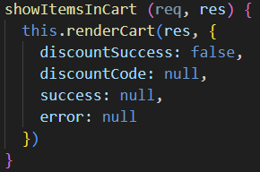
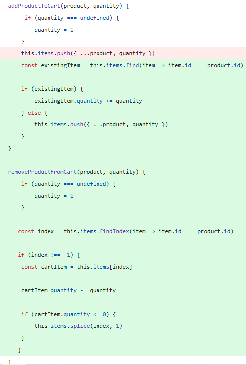
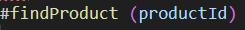
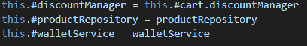
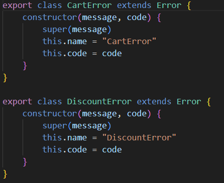
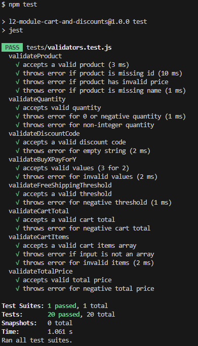
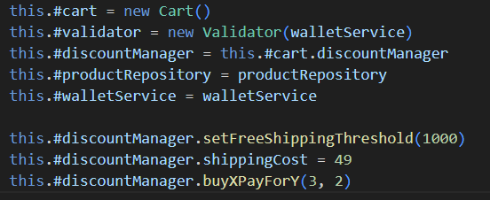
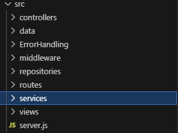

Ska jag vara riktigt ärlig så tycker jag detta är skitsvårt, När jag ska bryta ut, göra funktioner mindre, tänka på errorhandeling, tänka på klasser hit och dit, så känns det som jag mer och mer gör det svårare att utveckla. Att hålla koll på allt, det känns som jag måste tänka på så sjukt mycket mer, och mer komlicerat för att följa clean codes exempler och regler. 

## Kapitel 2: Meaningful Names

Jag tycker det är väldigt svårt att namnge allt som ska bli namngivet.
**Use Intention-reviling names** är väl någonstans den mest centrala reglen i kappitlet, men även den svåraste att utföra. 



Denna funktion har jag reflekterat mycket över, Den visar alla produkter i en kundvan, men ser man verkligen det? **AVOID DISINFORMATION** Man ska inte namnge något som likar förmycket. Kan man se att det är i prular när man kollar på den snabbt? ser man att det är itemS och inte item? 

I övrigt känner jag att jag följer det flesta reglerna som kappitlet tar upp, vissa regler behöver iallafall jag inte ens lägga en tanke på att uppfylla. Tex. **USE PRONOUNCEABLE NAMES**, **DONT BE CUTE** 

## Kapitel 3: Functions

Ett stycke i boken träffade mig mitt i prick **"How Do You Write Functions Like This?"**. Det handlar inte bara om att skriva funktioner tycker jag, det handlar om nästan alla kapitel, jag skriver kassa namn i början för att sedan refakturera, Skriver dåliga kommentarer, Dålig error handeling som bara jag fattar, långa funktioner etc. 



Här btyter jag mot många regler innan jag har refacturerat.

**Small!**, **Do One Thing**, delvis **Function Arguments**, **Don't Repeat Yourself**

Det är såhär jag tycker om att jobba, mata ut kod och strunta i reglerna ibörjan, få det att funka, sedan kan jag börja städa för att få clean code. 

## Kapitel 4: Comments

Generellt har jag aldrig gillat att skriva kommentarer eller läsa andras kommentarer för den delen heller. Detta är det kappitlet jag sympatiserar mest med i hela boken. 

Med det sagt skulle kanske jag behöva skriva mer kommentarer **Comments Do Not Make Up for Bad Code**, Jag skriver troligtvis mycket konstig och dålig kod, men jag försöker att städa, och försöker tillämpa **Explain Yourself in Code**. Jag tyvärr har jag insett att jag använder **Commented-Out Code** väldigt mycket när jag refacturerar och kan ibland glömma att ta bort gammal kod. 

Sedan självklart skriver jag **Legal Comments** och ska jag skriva en kommentar försöker jag tillämpa **Mumbling**. 

Under workshoppen L2 jobbade jag tillsammans med en som skrev längre kommentarer än själva koden, jag läste inte ens kommentarerna då det tog längre tid än att förstå själva koden. **Redundant Comments**, **Noise Comments**

Jag använder däremot mycket **TODO Comments** som även clean code boken tycker är bra kommentarer, om det inte är en ursäkt för att skriva dålig kod. 


## Kapitel 5: Formatting

För att sammanfatta typ hela detta kappitel med ett citat från boken, "If  instead they see a scrambled mass of code that looks like it was written by a bevy of drunken sailors, then they are likely to conclude that the same inattention to detail pervades every other aspect of the project." 

Jag tycker jag följer **The Purpose of Formatting** även om jag "Fuskar" och använder ESLint, vilket gör **Indentation** väldigt enkelt. Med det sagt  har jag kollat igenom reglerna på kappitlet kopplat till mid kod. 

Jag har refacturerat så jag följer **The Newspaper Metaphor** och **Vertical Ordering** Viktiga delar och funktioner i början och i slutet ska det vara mindre viktiga. 

Tex. 

 

Denna är en hjälp funktion som ligger sist i min class vars ända uppgift är att hitta en produkt.

Jag använder även **Vertical Openness Between Concepts** för att lätt kunna följa med i koden. 

**Instance Variables** och **Vertical Density**(Eftersom det hör ihop) ligger i toppen på classerna, detta är lite olika från språken, i C++ ligger de i botten på classerna, men huvudsaken är att man ska kunna hitta dessa snabbt. 



**Dependent Functions** Jag vet inte riktigt om jag håller med helt och hållet på denna. Jag har försökt så gott jag kan att använda mig av detta men jag själv tycker att funktioner ska vara i botten, men där i ordning, så den första funktionen i klassen om kallar på en annan klass ska ligga först i botten(if that make sense?). 


## Kapitel 6: Objects and Data Structures

En central regel är **Law of Demeter**, som säger att metoder ska prata med sina “nära vänner” och inte navigera djupt i andra objekts interna struktur. Långa kedjor av metodanrop **train wrecks** bryter ofta mot denna princip.
Jag tycker att jag mer än oftast inte har det och följer reglerna, 
men i renderCart() och renderWallet() sprider jag flera objekt samtidigt med ..., vilket blir lite av en “**train wreck**”:

```js
res.render('cart/index', {
  ...this.cartService.getSummaryOfCart(),
  ...defaults,
  ...extraData
})
```

Utöver detta försöker jag kapsla in data och beteende, Jag använder mig av privata fält med publika metoder vilket gör att jag allt som oftast följer **Data Abstraction**. 

**Hiding Structure** tycker jag själv att jag fick till hyffsat bra i min L2 uppgift där jag hade ett tydligt interface, där själva logiken var gömd i en annan klass och funktioner.

Jag tycker att detta kappitlet är lätt och logiskt att förstå men väldigt svårt att faktiskt genomföra.

## Kapitel 7: Error Handling

Kapitlet handlar kort om att varje system kan kracha, det viktigaste är hur vi gör eller hanterar fel som kan uppstå i systemet. 

**Use Exceptions Rather Than Return Codes** Tror och tycker jag har på det ställen som kan göra att koden kan kracha. Däremot försöker jag bryta ut dessa så en funktion gör en sak om man ska referera till kapitel 3s funktioner.

**Provide Context With Exceptions** Denna tycker jag fick till ganska bra i mitt npm paket.



Här ser man direkt vilken källa felet kommer ifrån. Samt att jag i dessa försöker skicka med så inforrmativa meddelanden jag kan. 

**Dont Return Null** och **Dont pass Null** använder jag inte alls, detta togs upp i en slack tråd först innan jag hann att läsa detta kappitlet, så jag hade det hela tiden tanken i bakhuvudet. 


## Kapitel 8: Boundaries

För att kort förrklara detta kapitel så handlar det om när vi använder någon annans kod, typ open source eller om vi skulle jobba i ett team, eller ett npm paket som är fallet i detta projekt.

**Using Third-Party Code**: Generella gränssnitt som Map är kraftfulla men kan lätt missbrukas och skapa täta beroenden i systemet. Det är därför bättre att kapsla in dem i egna klasser som endast exponerar de metoder som verkligen behövs. Exempelvis kapslar min CartService de interna delarna på ett tydligt sätt och exponerar endast den funktionalitet som är relevant för användaren.

**Exploring and Learning Boundaries** Jag har aldrig gjort detta innan, men i och med att jag gjorde egena tester på min L2 modul (Och skrev den själv xD) så var det väldigt enkelt att impementera alla delar till min app. Även **Learning** var även det väldigt enkelt, något jag kommer att göra i framtiden när jag letar ramverk eller paket även **Learning Tests Are Better Than Free**. 




## kapitel 9: Unit Tests

I detta kapitlet ska jag vara ärlig och säga att jag inte följer många regler kopplat till min kod. **The Three Laws of TDD** här lyckas jag bara med den sista reglen. 

**Keep tests Clean** Enligt boken är unit tests lika om inte viktigare är produktionskoden. Jag vet ärligt inte hur man ska skriva bra tester mer än det som stod i **Clean Tests**, därför kan jag inte riktigt avgöra om mina tester är godkända. Däremot tycker jag att jag delvid följer **Single Concept per Test** och **F.I.R.S.T**. 

```js
describe("validateTotalPrice", () => {
  test("accepts valid total price", () => {
    expect(() => validateTotalPrice(250)).not.toThrow()
  })

  test("throws error for negative total price", () => {
    expect(() => validateTotalPrice(-1)).toThrow(DiscountError)
  })
})
```

Jag köper det han säger i kappitlet, men jag personligen tycker att det blir ett väldig hoppande fram och tillbaka i koden mellan tester och produkktionskod. Tycker han bryter mot sina egna regler här då han i tidigare kappitel tar upp **"How Do You Write Functions Like This?"** från kapitel 3, Där han bara spyr ut kod för att få det att funka. 


## Kapitel 10: Classes

Jag tycker detta kappitel var ganska "självklart" och något vi även pratar mycket om i kursen 1DV607, Så det var rätt naturligt när jag skapade mina klasser att det skulle följa tex **Class Organization**, **Encapsulation** och **Cohesion** även om jag inte alltid följer den sistnämda... Detta i sin tur gör att i just denna klass misslyckas jag även med **Classes Should be Small!**, inte för att det är mycket kod utan för klasser mäter man i storlek på dess ansvarsområden(Responsibilities) men även **The Single Responsibility Principle**. 



Den ska väl kanske göras om och följa **Maintaining Cohesion Results in Many Small Classes**. 

Kort och gott måste man nästan följa alla regler känner jag nu, annars faller det som en domino...

## Kapitel 11: Systems

**How Would You Build a City?** Precis som städer gradvis växer och kräver tydliga ansvarsområden behöver även system samma struktur. En snickare ska vara specialist på just att snicka, inte att dra el eller försöka vara rörmockare, samma med system. Enligt mig har jag typ denna struktur i form av Controllers, services, repositories etc. Detta gör att man kan vidareutveckla **Scaling Up**. 



**Separate Constructing a System from Using It** Väldigt bra liknelse från verkligheten, iallafall min kod har väldigt mycket kranar och byggställningar i uppstarten, mycket console.log och dålig kod, för att sedan ta bort lite i taget och bygga om. 

**Test Drive the System Architecture** Jag strukturerade min kod i många olika moduler och klasser. Eftersom logiken i tex CartService inte är beroende av Express kan den testas isolerat. Jag försöker också hålla klasserna enkla (POJOs) för att de ska vara lättare att utöka och refaktorisera över tid.

**Dependency Injection** är väl någonstans den del som är viktigast i detta kapitlet. Jag injicerar alla beroenden i konstruktorn, t.ex. CartService i CartController, vilket följer Inversion of Control. Det gör att klasserna inte själva ansvarar för att skapa sina beroenden, vilket följer Single Responsibility Principle.
