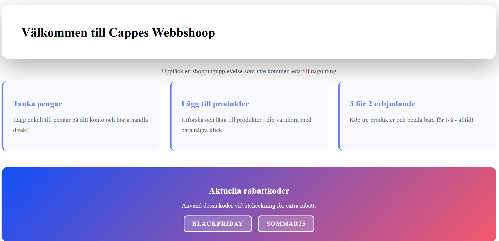
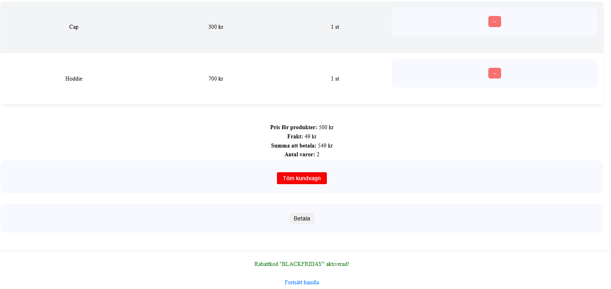

# Cappes Webshop Application

IS a simple **e-commerce web application** built with **Node.js and Express**.

The webshop allows users to:
- View products  
- Add and remove items from the shopping cart  
- Apply discount codes (BLACKFRIDAY, SOMMAR25)   
- Manage wallet balance  
- Complete purchases with 3-for-2 offers

This project was developed for educational purposes to demonstrate **basic e-commerce flows** and **manual testing** in a web-based application. **You cant actually buy something in this shop.**

## Features

- **Product Management**: Browse and view available products
- **Shopping Cart**: Add/remove items with real-time updates
- **Wallet System**: Top up balance and track transactions
- **Discount System**:
   - 3-for-2 automatic discount
   - Promo codes (BLACKFRIDAY, SOMMAR25)

## The App

[Webbshopp](https://l3-app-1dv610-production.up.railway.app/)

## Installation

If you whant to have a local copy of this project on your computer please follow this link:

[Get your local copy](https://github.com/Cappe99/L3-App-1DV610/blob/main/Docs/installProject.md)

## Usage

### Available Discount Codes

- **BLACKFRIDAY** - Special Black Friday discount
- **SOMMAR25** - Summer 2025 promotion

### How to Use the Webshop

1. **Add Funds**: Go to the wallet("Plånbok") page and top up your balance
2. **Browse Products**: Explore available items on the shop page
3. **Add to Cart**: Click on products to add them to your cart
4. **Apply Discounts**: Enter discount codes at checkout
5. **Complete Purchase**: Finalize your order

## Built With

- **Node.js** - JavaScript runtime
- **Express.js**- Web application framework
- **EJS** - Templating engine
- **CSS** - Styling

## Testing

[Test Documentation](https://github.com/Cappe99/L3-App-1DV610/blob/main/Docs/Testspecifikation.md)

## Contributing

Contributions are welcome!

If you want to help improve this project, here’s how you can get started:

[developer guide](https://github.com/Cappe99/L3-App-1DV610/blob/main/Docs/Contributing.md)

Find bug or improvment? Write a issue at [Issues](https://github.com/Cappe99/L3-App-1DV610/issues)

## Versioning

- This project follows **Semantic Versioning (SemVer)**:
- MAJOR – Breaking changes
- MINOR – Backwards-compatible new features
- PATCH – Bug fixes

The current version is **1.0.0.**

## License

This project is licensed under the **MIT** License - see the LICENSE file for details.

## Acknowledgments

Built as part of a course project at **Linnaeus University**

## Docs to Daniel

[Improved L2 documennt](https://github.com/Cappe99/L2-Module/blob/improved/docs/imporvedCode.md)

[Chapter Reflections](https://github.com/Cappe99/L3-App-1DV610/blob/main/Docs/reflection.md)

[Kravspecifikation](https://github.com/users/Cappe99/projects/1)

[projektvision](https://github.com/Cappe99/L3-App-1DV610/blob/main/Docs/projektvision.md)
